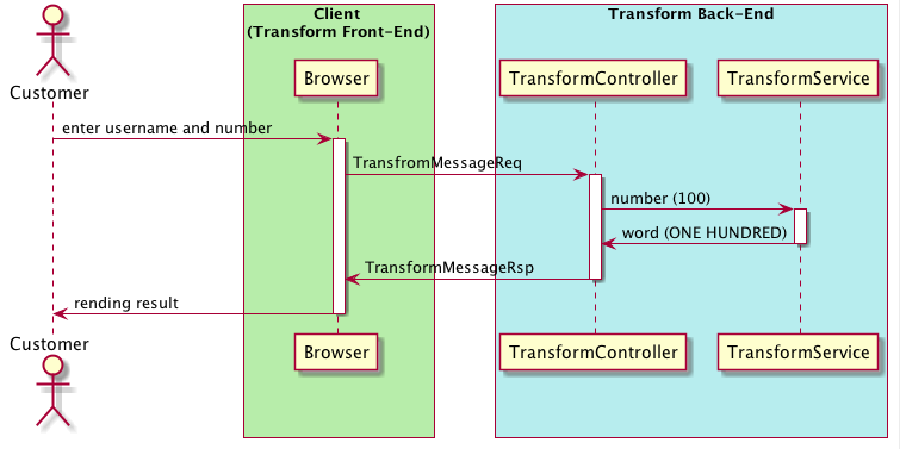

# Technical Design Document

## Background

this application is for HaloGO program testing

## Business requriement analysis

As web application, it will convert digital number to word. For example:

| Digital Number | Word                                                      |
| -------------- | --------------------------------------------------------- |
| 123.45         | ONE HUNDRED AND TWENTY-THREE DOLLARS AND FORTY-FIVE CENTS |
| 100            | ONE HUNDRED DOLLARS                                       |

### UI Design


## Solution Overview

This application is JAVA web application based on Spring Boot and can be deployed to any J2EE container.

This application use Vue.js as front-end javascript template and also integrated with Bootstrap. The front-end can be running as standalone node.js app.

It will use MySQL as database in PROD environment and use in-memory H2 as developer databased.

It has integrated with JWT authentication and this application will work as IDP as well. The default username/password is admin/admin.

| WARNING: Please login before doing any test! |
| -------------------------------------------- |


It also implements Junit, integration test and front-end test (based on protractor). Please refer test folder.

## Application Flow:



## Code Overview

The business requirements will be implemented in class TransformService

```
au.com.halogo.service.TransformService
```

For the API endpoint, please refer:

```java
au.com.halogo.web.rest.TransformController
```

## Test Overview

For backend Test cases

```java
au.com.halogo.web.rest.TransformControllerIT
au.com.halogo.service.TransformServiceT
```

For frontend test cases

```javascript
transform.component.spec.ts;
```

## User Case

1. please login via click 'Account->Login' with admin/admin
2. goto url: /transfrom
3. entry username/number, such as:

   | Username | Number |
   | -------- | ------ |
   | nzhu     | 123.45 |

4. And click 'Submit' button
5. check the result
